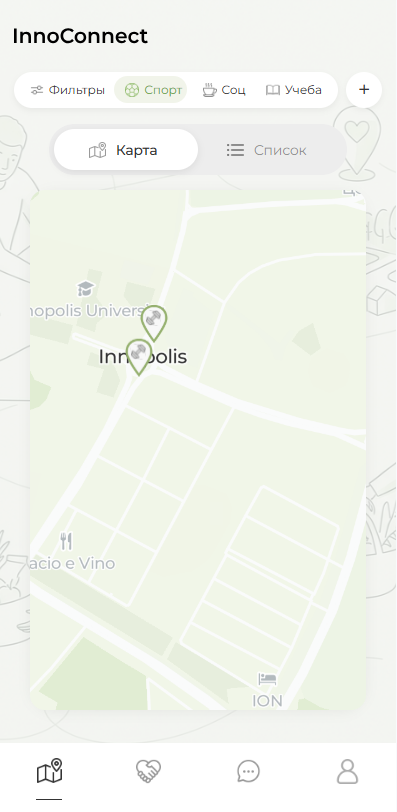
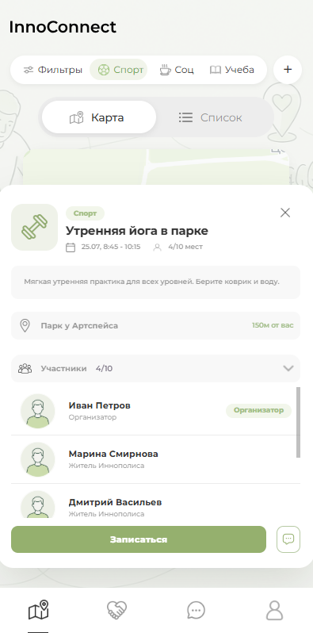
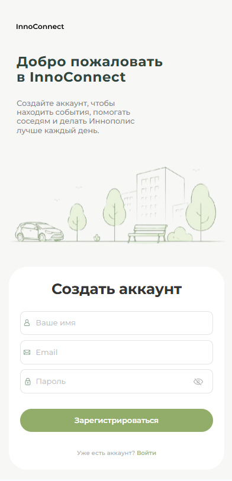

# InnoConnect

Hello *hello!* **HELLO!!!!**

## Project startup process

* create ```.env``` file or rename ```.env.example``` -> ```.env```

### Frontend

To run fronend part run following sequence of commands

```
cd frontend
npm install
npm run dev
```

To stop just press CRTL+C in terminal

### Backend

I will show you how to run this project using docker!

It's simple: 
* then open here a ```terminal``` or ```cmd```
* run ```make init``` or dev build: ```make dev init```
* And it starts!!!
* you can verify it by writing ```docker ps -a``` in the terminal and see (healthy) mark at the corresponding container names
* or **STOP** it using ```make down```
* edit ```.env``` files if you want

*This is IT*! 
Good **luck** in your future work!

Best withes, MJ, V. Make-ovsky and AF


## Screenshots




